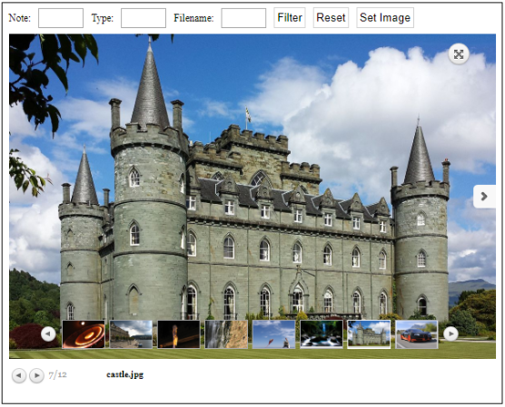
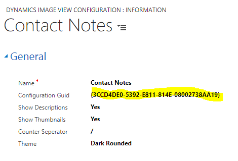
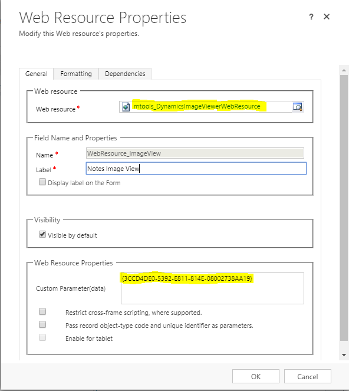
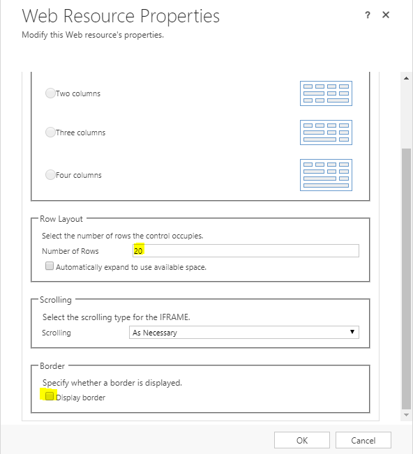

# Dynamics-Image-View
A dynamics 2016 and 365 image viewer to view attached note's images. It offers searching and the ability to set the entity image to one of the viewing images.

**Set Up**

Import managed or un managed solution from the solutions folder
Create a new Dynamics Image Viewer Configuration instance

Copy the configuration Guid
Go to the form where you are to add the image viewer and add a web resource mtools_DynamicsImageViewerWebResource
Paste the Guid from the Dynamics Image Viewer Configuration to the Custom Parameter(data) text field on the Web Resource Properties section

Under Web Resource Properties Formatting tab, enter a value for number or rows (12 / 15 / 20 / ...) and uncheck the Display border check box under Border section

